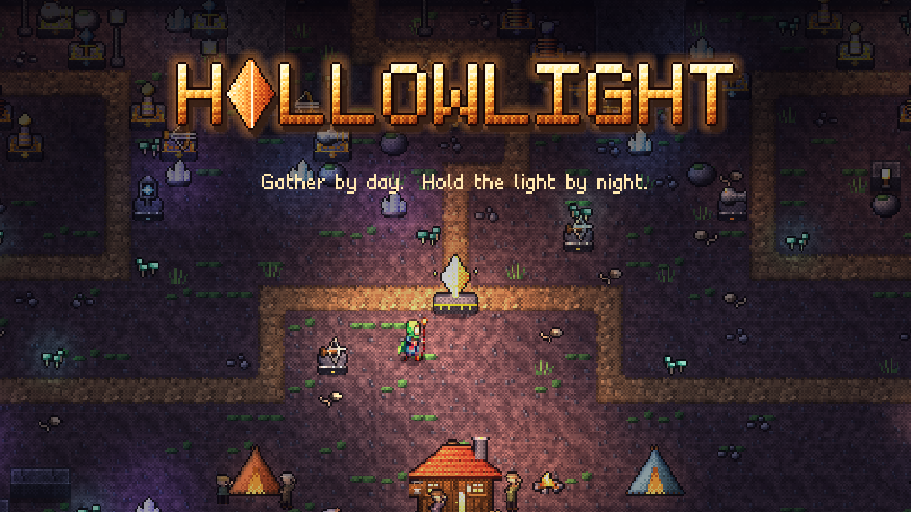

  

  <b>Gather by day. Hold the light by night.</b> 
  A survivors × tower defense game that plays free in your browser.

  <a href="https://hollowlightgame.com"><b>▶ Play now</b></a> ·
  <a href="https://discord.gg/UtCTyW7vR6">Discord</a> ·
  <a href="https://hollowlightgame.com/notes/">Patch notes</a>

---

## What is Hollowlight?

You are the Lamplighter, keeper of the last light in the Hollow. Each **day** you climb to the Surface: explore a new world,
chop and mine, fight roaming monsters, rescue lost villagers, raid ruins and seal rifts. Each **night** the Hollow floods
with monsters through its tunnels, and you hold the line with the towers you built and the powers you've gathered.

- **Survivors-style hero:** your weapons fire on their own. Level up, pick powers, evolve them and stack items from chests.
- **Tower defense:** build and upgrade Bolt, Mortar, Frost, Arc and Sunfire towers, ascend them with Starsteel and add modifiers.
- **Boss clashes:** every few nights a boss arrives for a real-time fight. Parry its attacks, break its parts, chain weakness
  combos into finishers, bring your best towers and go for an S grade.
- **Titans and events:** three Titans roam the Surface and unlock special turrets; traders, shrines, trial altars, meteors
  and treasure goblins make each day different.
- **30 nights to win,** on Normal, Hard or Nightmare, with an online leaderboard.

## Controls

| | Keyboard / mouse | Controller |
|---|---|---|
| Move | WASD / arrows | Left stick |
| Interact / gather | E (hold) | A |
| Dash | Space | |
| Flare | Q | |
| Build towers | 1–7 (Titan turrets 8, 9, 0), click to place | Bumpers to pick |
| Upgrade / sell tower | U / X | D-pad |
| Skip to dusk / start the night | Enter or G | |
| Game speed | F | Back |
| Pause | P or Esc | Start |

**Boss clashes:** 1–5 tower skills, Space guard / parry, E weak point, Q flare, R limit break, C punch, V aim punches at
the boss's breakable part. Every key can be rebound under Settings → Controls.

## Community

Join the [Hollowlight Discord](https://discord.gg/UtCTyW7vR6) for patch notes (posted automatically with every update),
feedback, bug reports and runs.

## About this repository

This repository only holds the exported web build that GitHub Pages serves at
[hollowlightgame.com](https://hollowlightgame.com). The game is made with Godot; its source is private and each release
is published here automatically.

The game sends anonymous gameplay data (for example which night a run ended on) to help with balancing. You can turn it
off on the title screen under Settings → "Share anonymous gameplay data". The leaderboard only shows the name you type.

© Hollowlight. All rights reserved.
